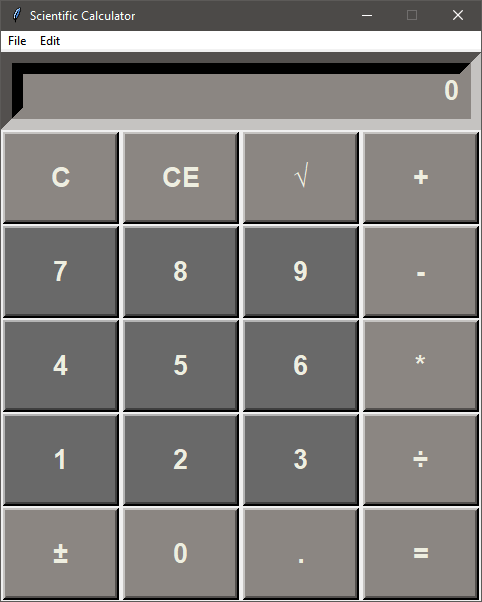
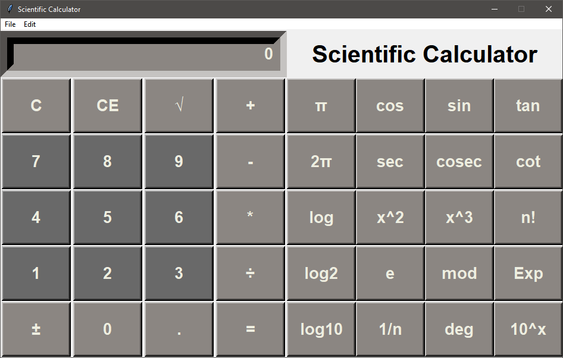

# 2-in-1 Calculator
The Application opens to a simple calculator which has basic operations like add, subtract, multiply, divide.
The menu bar contains a buttons named 'File' which allows you to switch to scientific mode.
The Scientific Calculator lets you perform additional operations like inverse, cube, square, log, sin, cos, tan, and a few more..

## Requirements
Python v3 and Tkinter

## Screenshots
1. Standard Calculator

2. Scientific Calculator

